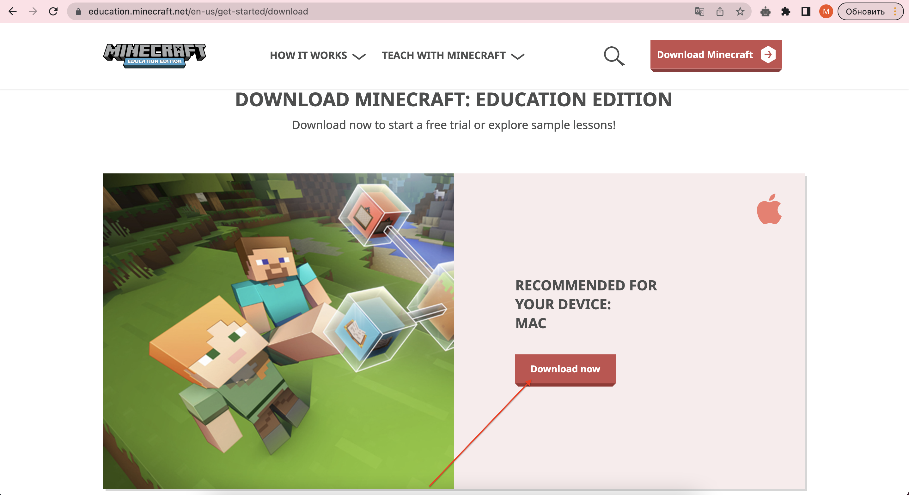
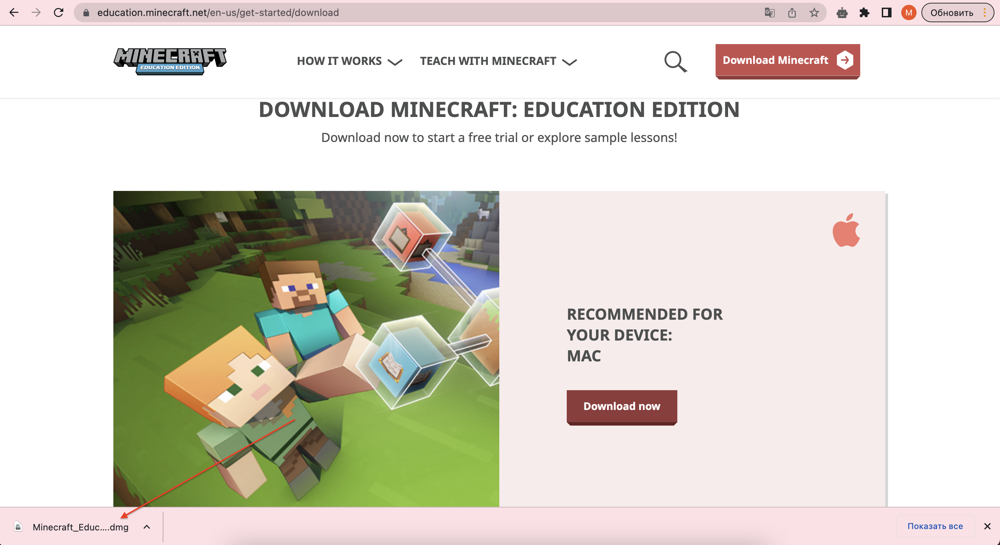
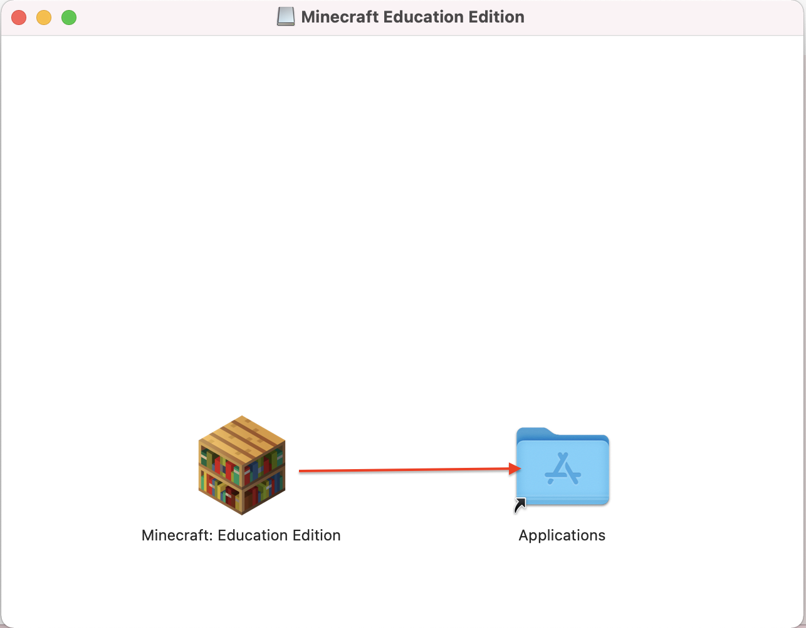
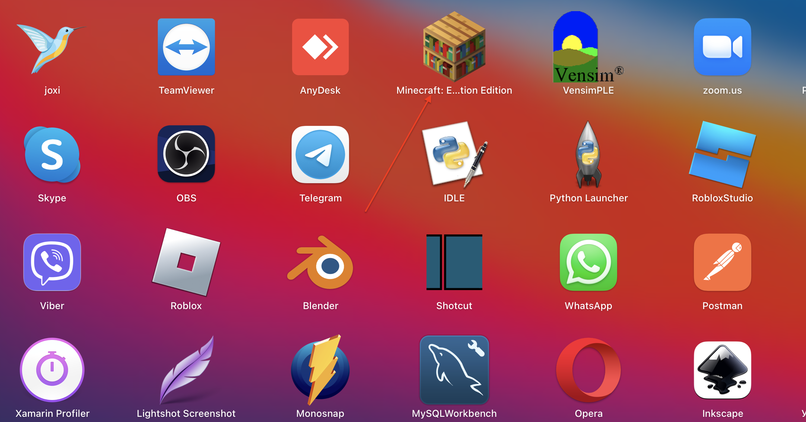
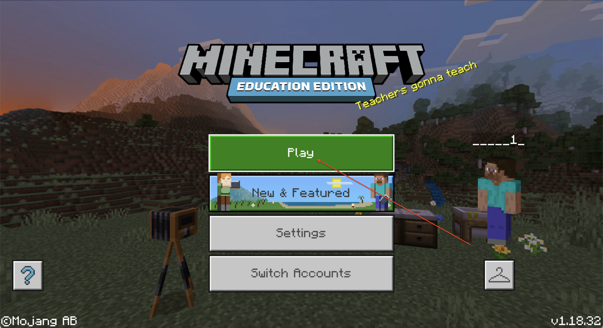

# Instruction for installing Minecraft Education Edition
1. Download Minecraft Education from <a href = "https://education.minecraft.net/en-us/get-started/download">official site</a>.
  

2. Install downloaded application 
 

3. Copy installed application to Aplication directory
  

4. Open Minecraft Education Application
  

GoiteensLove_1@educationmir.onmicrosoft.com
Qwerty123

5. 
  

