# Instruction for installing Minecraft Education Edition
1. Download Minecraft Education from <a href = "https://education.minecraft.net/en-us/get-started/download">official site</a>.  
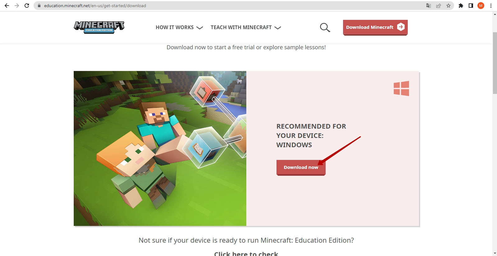  

2. Install downloaded application 
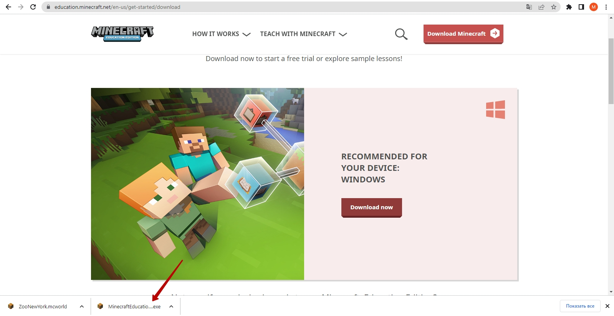  

3. Open Minecraft Education Application  
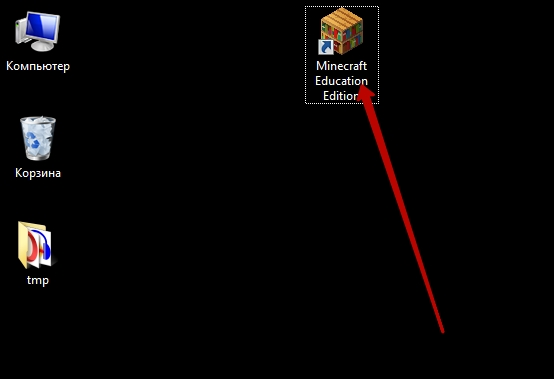  

4. Input   

Login:  
**GoiteensLove_1@educationmir.onmicrosoft.com**
  
Password:  
**Qwerty123** 

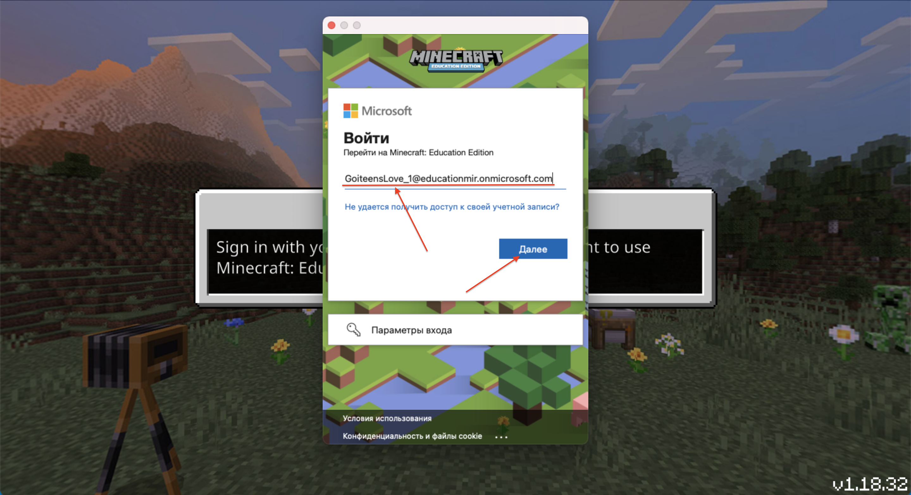  

5. Click the button "Play"  
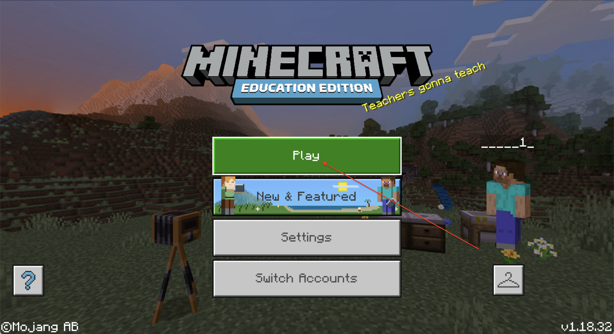  

6. Download file of World: <a href = "https://github.com/mikh-maksi/MinecraftEnglish/blob/main/files/ZooNewYork.mcworld" target = _blank>ZooNewYork</a>   
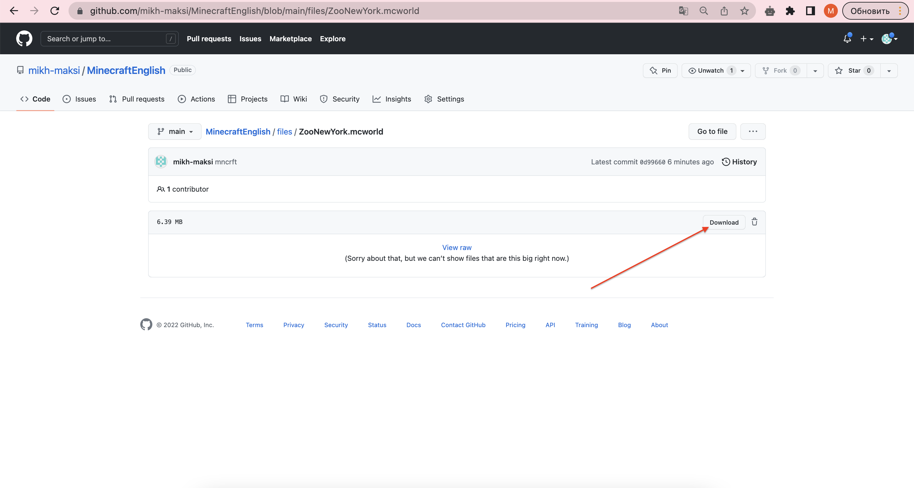  
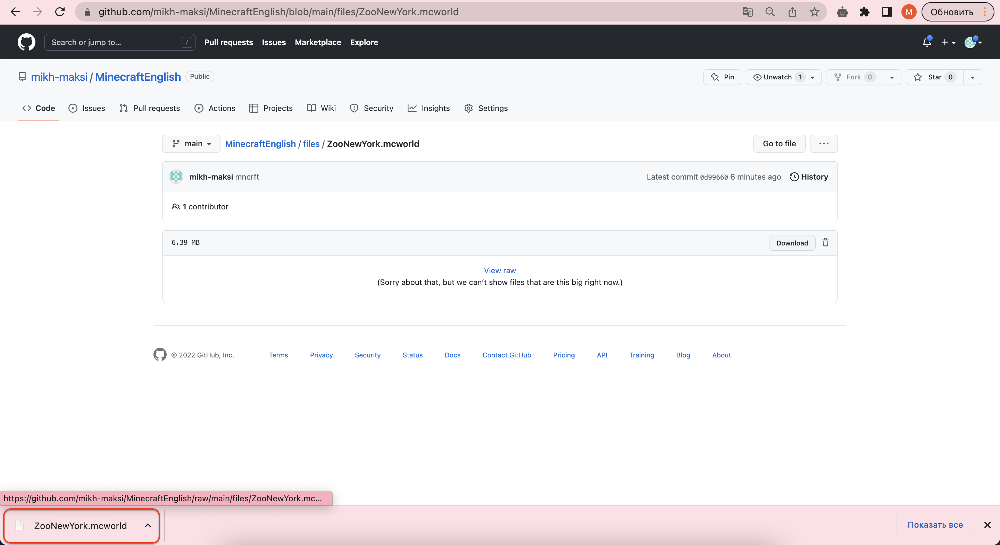  

7. Click the button "Import"    
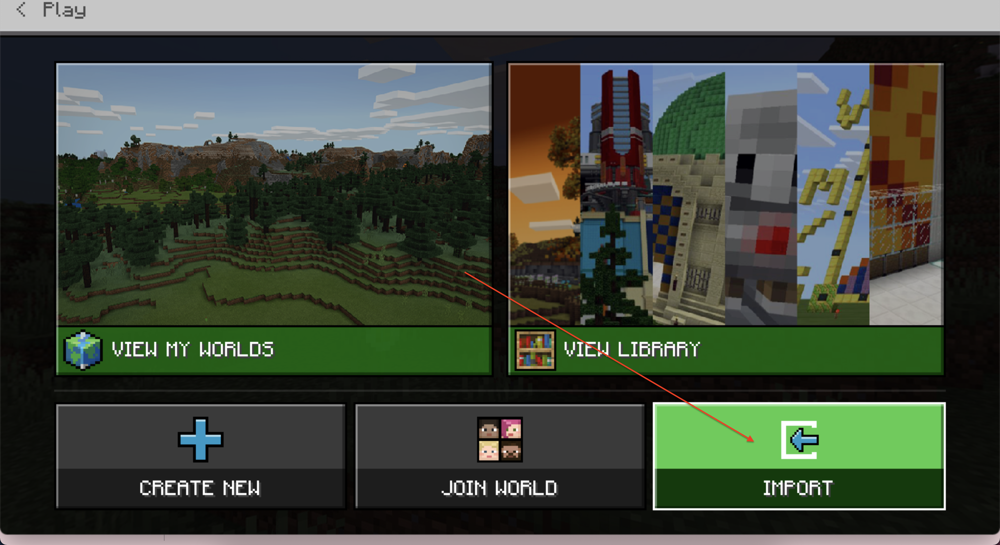   

8. Open downloaded file 
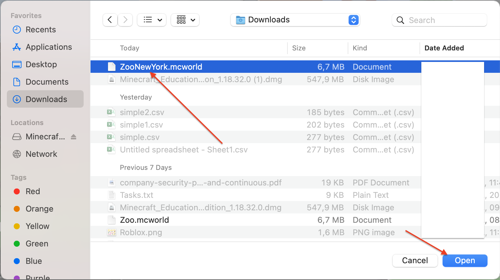  
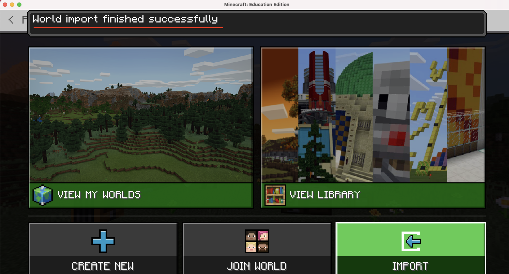  

9. Click button "View my worlds"
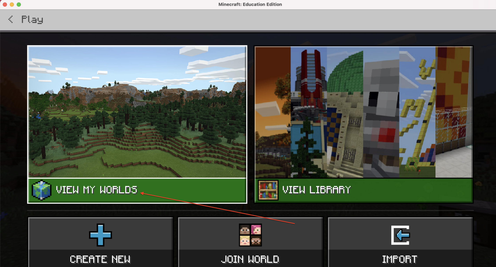

10. Choose the world with name "Forest Biom"
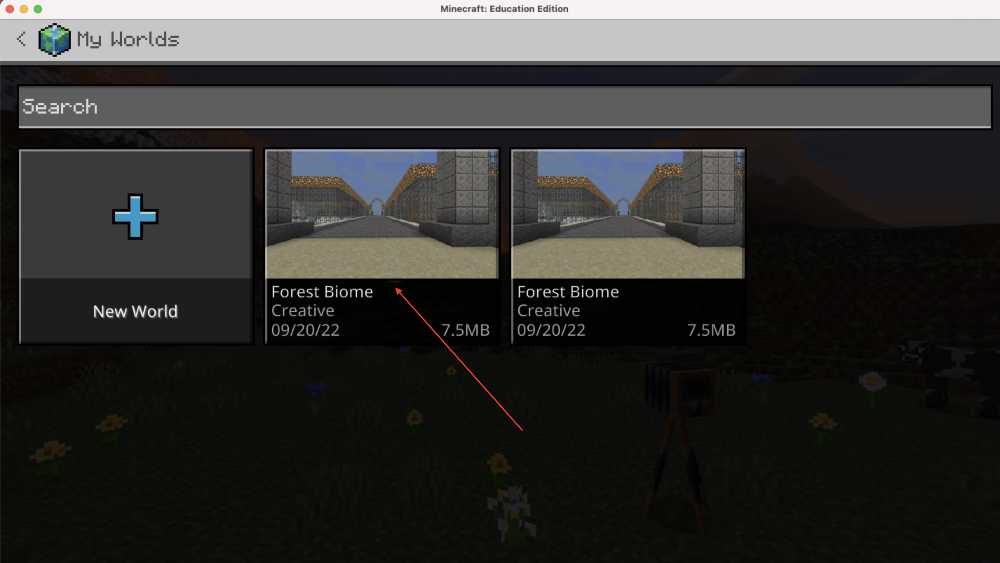  

11. Click "Play" button
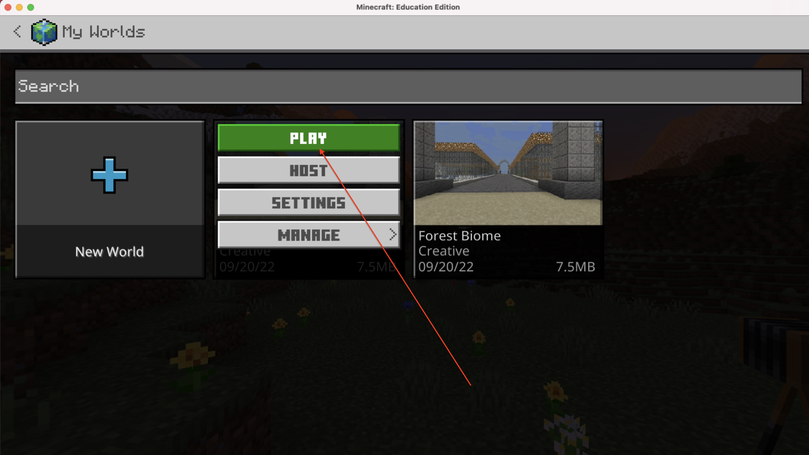  

12. You are ready to play!
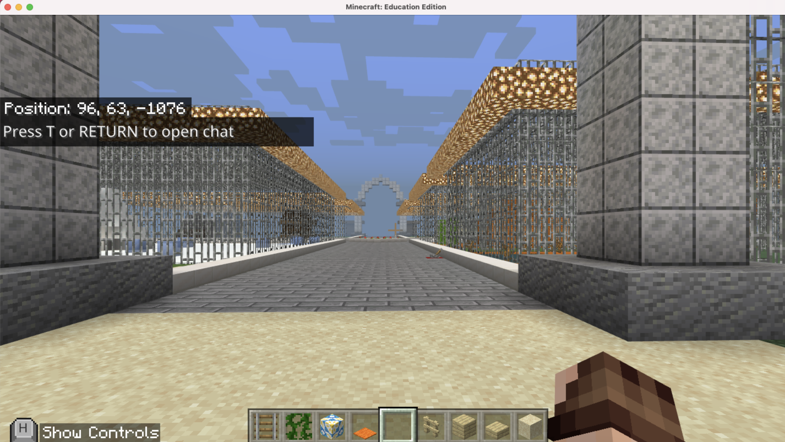  

